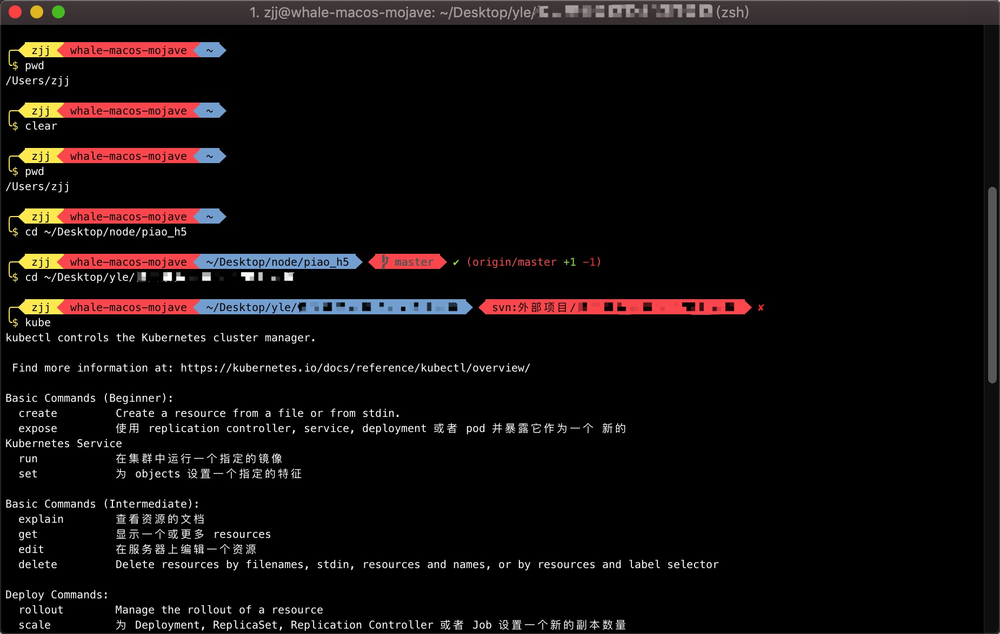

# whale.zsh-theme

A fast reimplementation of whale ZSH theme.

### Preview

[](https://asciinema.org/a/240302)


### Set Up

1、Terminal & Shell We're going to use iTerm2 as our default terminal with a zsh shell.

> Installation
```bash
brew cask install iTerm2
```

> Settings
```text
1、Under Profiles->Colors, load and apply the Broadcast color theme
2、Under Profiles->Text, change the font to Meslo LG M Regular for Powerline 10pt
3、Under Profiles->Terminal, Character Encoding should be UTF-8 and Terminal Type xterm-256color
```

2、Install zsh We're going to use zsh as a replacement for bash.

> Installation
```bash
git clone https://github.com/whalesea520/whale-zsh-theme.git
cd whale-zsh-theme
chmod +x install-mac.sh
./install-mac.sh

chsh -s $(which zsh)
```

3、Reload the configuration file or restart iTerm2 for the change to take effect
```bash
killall iTerm2 &> /dev/null
open -a /Applications/iTerm.app/
```
